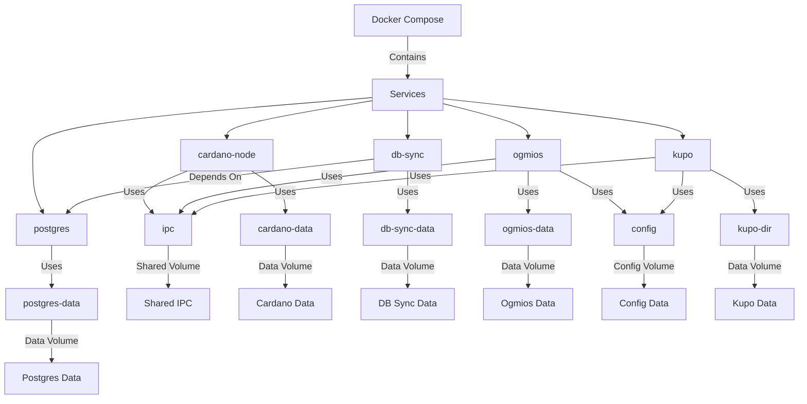

# Partnerchain Dependencies Docker

This allows easy orchestration of partnerchain dependency services.



## Usage

1. Clone repo

2. Navigate to .yml file and `docker-compose up`

```shell
cd partnerchain-dependencies
docker-compose up -d
```

🚀 That's it.